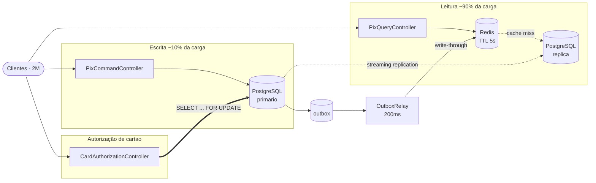

# CoreBank

Fintech de conta digital.
Este repositório implementa o desafio proposto de System Design.

## Problemas

- 2 milhoes de contas ativas.
- Toda consulta ia direto ao PostgreSQL primario.
- Banco com CPU em 90%.
- Escritas (PIX, cartao) sao apenas 10% da carga, mas competiam pelos mesmos recursos.
- **Requisito:** o saldo exibido pode ter ate 5 segundos de defasagem apos uma
  transação; a autorização do cartão precisa ser **precisa** (nao pode negar por saldo errado).

## Pre-requisitos

- Java 21+
- Maven 3.8+
- Docker e Docker Compose

## Arquitetura da aplicação



## Estrutura do código

```
src/main/java/com/corebank/
├── command/            escrita de PIX (primario)
├── query/              leitura de saldo e extrato (Redis -> replica)
├── authorization/      autorizacao de cartao (primario, sob lock)
├── outbox/             evento transacional e atualiza o cache a cada x tempo.
├── shared/
│   ├── cache/          Classe de Cache - BalanceCached
│   ├── idempotency/    Classe para lidar com a Idempotência
│   ├── exception/      Exceções de negócio
│   └── api/            HTTP error handler.
└── config/             Configs dos datasources primário e sua réplica
```

## Setup

```bash
docker compose up -d
```

Subindo em três containers:

| Container | Porta |
|---|---|
| `corebank-postgres-primary` | 5432 |
| `corebank-postgres-replica` | 5433 |
| `corebank-redis` | 6379 |


```bash
docker exec corebank-postgres-primary psql -U postgres -d corebank \
  -c "SELECT application_name, state, sync_state, replay_lag FROM pg_stat_replication;"

docker exec corebank-postgres-replica psql -U postgres -d corebank \
  -c "SELECT pg_is_in_recovery();"
```

## Rodando a aplicacao
App disponível na porta 8080.
```bash
mvn spring-boot:run
```

## Testes

Os testes unitários usam mocks: não precisam dos containers do Postgres ou Redis no ar.

```bash
mvn test
```

```bash
mvn -Dtest=AccountTest test                                     
mvn -Dtest='AccountTest*#debitsAvailableAndTotalBalance' test
```

### Cobertura de código

O JaCoCo utiliza o `mvn verify`. Portanto para gerar o report:

```bash
mvn verify
```

O HTML fica no `target/site/jacoco/index.html`:

```bash
open target/site/jacoco/index.html
```

## Endpoints

### Escrita - PIX

```bash
curl -X POST http://localhost:8080/api/pix/payment \
  -H 'Idempotency-Key: 550e8400-e29b-41d4-a716-446655440000' \
  -H 'Content-Type: application/json' \
  -d '{"originAccountId":1001,"targetPix":"joao@banco.com","value":250.00}'
```

```json
{ "endToEndId": "E1787029754049...", "status": "COMPLETED" }
```

Repetir a chamada com a mesma `Idempotency-Key` devolve o mesmo `endToEndId` com
status `REPLAYED`, sem debitar de novo.

### Consulta o Saldo e Extrato

```bash
curl http://localhost:8080/api/pix/1001/balance
curl 'http://localhost:8080/api/pix/1001/statement?limit=20&offset=0'
```

### Autorizacao de Cartão:

```bash
curl -X POST http://localhost:8080/api/card/authorization \
  -H 'Idempotency-Key: 7c9e6679-7425-40de-944b-e07fc1f90ae7' \
  -H 'Content-Type: application/json' \
  -d '{"accountId":1001,"amount":80.00,"merchant":"Restaurante"}'

curl -X POST http://localhost:8080/api/card/authorization/{authorizationCode}/capture

curl -X POST http://localhost:8080/api/card/authorization/{authorizationCode}/reversal
```

```json
{ "authorizationCode": "AUT4581B911A3AF43EA", "status": "APPROVED",
  "reason": null, "availableBalance": 20.00 }
```

## Codigos de resposta HTTP

| Situacao | HTTP | Codigo |
|---|---|---|
| Valor inválido, campo faltando, header ausente | 400 | `VALIDATION_ERROR`, `MISSING_HEADER` |
| Conta ou autorização inexistente | 404 | `NOT_FOUND` |
| Chave de idempotência em processamento | 409 | `REQUEST_IN_PROGRESS` |
| Autorização j´å capturada ou estornada | 409 | `INVALID_AUTHORIZATION_STATE` |
| Saldo insuficiente para PIX | 422 | `INSUFFICIENT_BALANCE` |
| Banco indisponível (retentavel) | 503 | `DATASTORE_UNAVAILABLE` |

## Configuração de TTL e Relay pro Redis

| Propriedade | Padrao | Descrição |
|---|---|---|
| `corebank.cache.balance-ttl` | `5s` | TTL do saldo. |
| `corebank.outbox.poll-interval` | `300` | Intervalo de varredura do relay, em ms. |
| `corebank.outbox.batch-size` | `200` | Eventos por ciclo. |
| `spring.datasource.primary.hikari.maximum-pool-size` | `20` | Pool do primario. |
| `spring.datasource.replica.hikari.maximum-pool-size` | `40` | Pool da replica - maior, e onde mora a carga. |

## Edge cases - Cenários do Banco e Redis

**A leitura realmente usa a Réplica?** 
Derrubando a réplica: saldo e extrato. Resposta com HTTP 503.
Transações de PIX e autorização de cartão funcionam somente no banco primário.

```bash
docker stop corebank-postgres-replica
docker exec corebank-redis redis-cli DEL account_balance:1001
curl -i http://localhost:8080/api/pix/1001/balance          # 503
curl -X POST http://localhost:8080/api/card/authorization \
  -H 'Idempotency-Key: teste-1' -H 'Content-Type: application/json' \
  -d '{"accountId":1001,"amount":10.00,"merchant":"Teste"}' # 200
docker start corebank-postgres-replica
```

**Parando o Redis:**

```bash
docker stop corebank-redis
curl http://localhost:8080/api/pix/1001/balance 
docker start corebank-redis
```
# END
